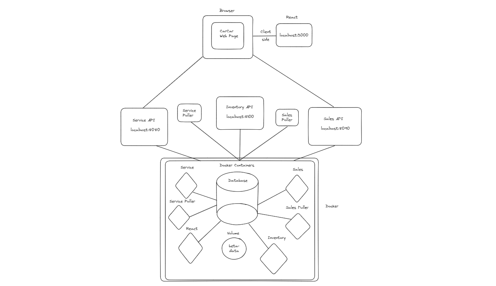

Team:

- Jihanyu Miao - Sales
- Joshua Kahn - Service

## Design

## Service microservice

## First Steps

To start, please make sure you have Docker, Git, and at least Node.js version 18.2 or above.

1.  Fork this repository
2.  Clone the forked repository onto your computer by using the command 'git clone <<repository url>>
3.  Using Docker, we run three commands to get the application built and running:

    docker volume create beta-data
    docker-compose build
    docker-compose up

The first command will provide us with a place to store data, the second will actually build the relevant containers, and the third will not only start things but also attach to containers for the service. Once you've made sure all the containers are running, we can really get started!

4. Please visit http://localhost:3000/ to view the site. Welcome to CarCar, our approach to top tier vehicle management!

   We'll be focusing on just the Service portion of our microservices, but there is also Inventory and Sales which run in tandem to bring everything together.

## Diagram

## API Documentation

### URLs and Ports

- Put URLs and ports for services here

### Inventory API (Optional)

- Put Inventory API documentation here. This is optional if you have time, otherwise prioritize the other services.

### Service API

- Put Service API documentation here

### Sales API

- Put Sales API documentation here

## Value Objects

- Identification of value objects for each service goes here

## Sales microservice

The sales API enables the user to track and create sales person , customers, and sales data related.

Salesperson:
| Action | Method | URL
| ----------- | ----------- | ----------- |
| List salesperson | GET | http://localhost:8090/api/salespeople/
| Create a salesperson | POST | http://localhost:8090/api/salespeople/
| Show a specific salesperson | GET | http://localhost:8090/api/salespeople/id/

in LIST, it returns a list of customer like
{
"salespeople": [
{
"first_name": "Adam",
"last_name": "Band",
"employee_id": "1234",
"id": 1
}
]
}

by CREATE, it needs provide information in a json body, includes:
{
"first_name": "Adam",
"last_name": "Band",
"employee_id": "1234",
}

and it will return with id created form.
{
"first_name": "Adam",
"last_name": "Band",
"employee_id": "1234",
"id": 1
}

Customer
| Action | Method | URL
| ----------- | ----------- | ----------- |
| List customers | GET | http://localhost:8090/api/customers/
| Create a customer | POST | http://localhost:8090/api/customers/
| Show a specific customer | GET | http://localhost:8090/api/customers/id/

In list, it returns a list of customer like

{
"customers": [
{
"first_name": "Adam",
"last_name": "Bacd",
"address": "123 St",
"phone_number": 4321983032,
"id": 1
}
]
}

by CREATE, it needs provide information in a json body, includes:

{
"first_name": "Adam",
"last_name": "Bacd",
"address": "123 St",
"phone_number": 4321983032,
}
and it will return with id created form.

{
"first_name": "Adam",
"last_name": "Bacd",
"address": "123 St",
"phone_number": 4321983032,
"id": 1
}

Sale
| Action | Method | URL
| ----------- | ----------- | ----------- |
| List sales | GET | http://localhost:8090/api/customers/
| Create a sale | POST | http://localhost:8090/api/customers/
| Show a specific sale | GET | http://localhost:8090/api/customers/id/

list a sale records return like:
{
"sales": [
{
"id": 1,
"price": 45000,
"vin": {
"vin": "LWEONDVSW"
},
"salesperson": {
"id": 1,
"name": "Adm",
"employee_id": 2467
},
"customer": {
"name": "Amy Bcde",
"address": "222 St",
"phone_number": "201398468"
}
}
]
}

by CREATE, it needs provide information in a json body, includes:
{
"salesperson": "Adm",
"customer": "Amy",
"vin": "LWEONDVSW",
"price": 45000
}

| Page Name        | URL                                       |
| ---------------- | ----------------------------------------- |
| Sales form       | http://localhost:3000/sales/create        |
| Sales List       | http://localhost:3000/sales/list          |
| Salespeople form | http://localhost:3000/salespeople/create  |
| Salespeople list | http://localhost:3000/salespeople/list    |
| Customer form    | http://localhost:3000/customer/create     |
| Customer list    | http://localhost:3000/customer/list       |
| Sales History    | http://localhost:3000/history/salesperson |
